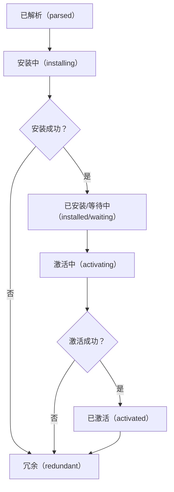

## 27.1 工作者线程简介

JavaScript 是**单线程**语言，这意味着所有代码都在一个线程上执行。工作者线程（Web Workers）允许在浏览器中**在后台线程上运行脚本**，不阻塞主线程。

### 27.1.1 工作者线程与线程

- 工作者线程运行在**独立的全局环境**中，与主页面不共享全局作用域
- 工作者线程与主线程之间通过**消息传递**（`postMessage()`）通信
- 工作者线程**没有**访问 DOM 的能力

### 27.1.2 工作者线程的类型

JavaScript 规范定义了三种主要的工作者线程：

1. **专用工作者线程（Dedicated Worker）**：只能被创建它的页面使用
2. **共享工作者线程（Shared Worker）**：可以被同源的多个页面共享
3. **服务工作者线程（Service Worker）**：用于拦截网络请求、推送通知和后台同步等

### 27.1.3 WorkerGlobalScope

工作者线程内部使用 `WorkerGlobalScope` 作为全局对象（而非 `Window`）。它的子类包括：

- `DedicatedWorkerGlobalScope`（专用工作者线程）
- `SharedWorkerGlobalScope`（共享工作者线程）
- `ServiceWorkerGlobalScope`（服务工作者线程）

**WorkerGlobalScope 的常见属性和方法：**

| 属性/方法 | 说明 |
| --- | --- |
| `navigator` | 返回 WorkerNavigator 实例 |
| `self` | WorkerGlobalScope 的引用（类似于 window） |
| `location` | 返回 WorkerLocation 实例 |
| `performance` | 返回 Performance 对象（只包含部分属性） |
| `console` | 返回 Console 实例 |
| `caches` | 返回 CacheStorage 实例 |
| `indexedDB` | 返回 IDBFactory 实例 |
| `importScripts()` | 加载并执行额外脚本 |

---

## 27.2 专用工作者线程（Dedicated Worker）

专用工作者线程是最常见的工作者线程类型，只能被创建它的脚本所使用。

### 27.2.1 创建专用工作者线程

```jsx
// main.js
const worker = new Worker('worker.js');

// 也可以通过 Blob URL 创建
const workerScript = `self.onmessage = ({data}) => console.log(data);`;
const workerBlob = new Blob([workerScript]);
const workerUrl = URL.createObjectURL(workerBlob);
const inlineWorker = new Worker(workerUrl);
```

> ⚠️ Worker 脚本文件必须与主页面**同源**。
> 

### 27.2.2 Worker 安全限制

- 工作者线程脚本只能从与父页面相同的源加载
- 不能使用 `file://` 协议在本地运行（需要 HTTP 服务器）

### 27.2.3 使用 Worker 对象

`Worker` 对象是主线程中与工作者线程交互的接口：

```jsx
const worker = new Worker('worker.js');

// 监听消息
worker.onmessage = (event) => {
  console.log('收到消息:', event.data);
};

// 监听错误
worker.onerror = (event) => {
  console.log('发生错误:', event.message);
};

// 发送消息
worker.postMessage('Hello Worker!');

// 终止工作者线程
worker.terminate();
```

### 27.2.4 DedicatedWorkerGlobalScope

在工作者线程内部，全局对象是 `DedicatedWorkerGlobalScope`，可通过 `self` 访问：

```jsx
// worker.js
self.onmessage = (event) => {
  console.log('Worker 收到:', event.data);
  self.postMessage('Worker 回复: ' + event.data);
};

// 也可以在内部关闭自己
self.close();
```

> `worker.terminate()` 和 `self.close()` 的区别：
> 

> - `terminate()` 从外部**立即终止**工作者线程，不给线程任何清理机会
> 

> - `close()` 从内部通知工作者线程取消事件循环中的所有任务，但**允许当前正在运行的同步代码执行完毕**
> 

### 27.2.5 生命周期

专用工作者线程的生命周期：

1. **初始化（initializing）**：创建 Worker 对象后、脚本加载执行前
2. **活动（active）**：脚本开始执行后进入活动状态
3. **终止（terminated）**：调用 `terminate()` 或 `close()` 后

### 27.2.6 配置选项

```jsx
const worker = new Worker('worker.js', {
  name: 'myWorker',     // 工作者线程的名称，可在内部通过 self.name 访问
  type: 'classic',       // 'classic' 或 'module'
  credentials: 'omit'    // 'omit'、'same-origin' 或 'include'
});
```

### 27.2.7 在 JavaScript 行内创建工作者线程

当无法使用外部脚本文件时，可以利用 Blob 和 Object URL 创建行内工作者线程：

```jsx
const scriptText = `
  self.onmessage = ({data}) => {
    self.postMessage(data * 2);
  };
`;
const blob = new Blob([scriptText]);
const url = URL.createObjectURL(blob);
const worker = new Worker(url);

worker.onmessage = ({data}) => console.log(data);  // 20
worker.postMessage(10);
```

### 27.2.8 动态执行脚本

工作者线程内部可以使用 `importScripts()` 加载并执行额外脚本：

```jsx
// worker.js
importScripts('script1.js', 'script2.js');  // 按顺序同步加载并执行
```

- 脚本按顺序**同步**下载并执行
- 导入的脚本共享工作者线程的全局作用域

### 27.2.9 委托任务到子工作者线程

工作者线程可以创建**子工作者线程**（嵌套 Worker）：

```jsx
// worker.js
const subWorker = new Worker('subworker.js');
subWorker.postMessage('来自父Worker的消息');
subWorker.onmessage = ({data}) => {
  self.postMessage('子Worker回复: ' + data);
};
```

> 子工作者线程的脚本解析路径**基于父工作者线程**，而非主页面。
> 

### 27.2.10 处理工作者线程错误

```jsx
// main.js
worker.onerror = (event) => {
  console.log(event.message);   // 错误信息
  console.log(event.filename);  // 发生错误的文件
  console.log(event.lineno);    // 行号
};
```

- 工作者线程内未捕获的错误会冒泡到 `Worker` 对象的 `error` 事件
- 但**不会**冒泡到主线程的全局上下文

### 27.2.11 与专用工作者线程通信

### 1. 结构化克隆算法（Structured Clone）

默认情况下，`postMessage()` 使用**结构化克隆算法**复制数据：

```jsx
// main.js
const obj = { name: 'test', arr: [1, 2, 3] };
worker.postMessage(obj);  // 对象被深拷贝
obj.name = 'changed';     // 不影响 worker 中接收到的数据
```

- 深拷贝对象，发送方和接收方持有**完全独立的副本**
- 支持大多数 JS 内置类型（包括 Map、Set、Date、RegExp、ArrayBuffer 等）
- **不支持**：函数、DOM 节点、Error 对象、Symbol

### 2. 可转移对象（Transferable Objects）

对于大数据（如 `ArrayBuffer`），克隆代价高昂。可以使用**可转移对象**实现零拷贝转移：

```jsx
// main.js
const buffer = new ArrayBuffer(1024 * 1024); // 1MB
console.log(buffer.byteLength); // 1048576

// 将 buffer 转移给 worker（零拷贝）
worker.postMessage(buffer, [buffer]);

console.log(buffer.byteLength); // 0 —— 原始 buffer 已被清空（neutered）
```

可转移对象包括：

- `ArrayBuffer`
- `MessagePort`
- `ImageBitmap`
- `OffscreenCanvas`

### 3. SharedArrayBuffer

`SharedArrayBuffer` 允许主线程和工作者线程**共享同一块内存**：

```jsx
// main.js
const sharedBuffer = new SharedArrayBuffer(1024);
const view = new Uint8Array(sharedBuffer);
view[0] = 42;

worker.postMessage(sharedBuffer);

// worker.js
self.onmessage = ({data}) => {
  const view = new Uint8Array(data);
  console.log(view[0]); // 42 —— 与主线程共享同一块内存
};
```

> ⚠️ `SharedArrayBuffer` 存在**竞态条件**风险，需使用 `Atomics` API 进行同步。
> 

### 27.2.12 线程池模式

在实际应用中，通常会创建一个**固定大小的线程池**来复用工作者线程：

```jsx
class WorkerPool {
  constructor(poolSize, workerScript) {
    this.taskQueue = [];
    this.workers = [];
    this.availableWorkers = [];

    for (let i = 0; i < poolSize; i++) {
      const worker = new Worker(workerScript);
      worker.onmessage = () => {
        // 任务完成，将 worker 放回可用池
        this.availableWorkers.push(worker);
        this._dispatchIfAvailable();
      };
      this.workers.push(worker);
      this.availableWorkers.push(worker);
    }
  }

  enqueue(message) {
    this.taskQueue.push(message);
    this._dispatchIfAvailable();
  }

  _dispatchIfAvailable() {
    if (this.taskQueue.length && this.availableWorkers.length) {
      const worker = this.availableWorkers.pop();
      const task = this.taskQueue.shift();
      worker.postMessage(task);
    }
  }

  close() {
    this.workers.forEach(w => w.terminate());
  }
}
```

---

## 27.3 共享工作者线程（Shared Worker）

共享工作者线程可以被**多个同源页面**（包括 iframe）共享。

### 27.3.1 创建共享工作者线程

```jsx
const sharedWorker = new SharedWorker('sharedWorker.js');
```

- 多个页面使用**同一个 URL** 创建 `SharedWorker` 时，实际只会创建**一个**工作者线程实例
- 共享工作者线程的**标识**基于脚本 URL 和可选的 `name` 参数

### 27.3.2 SharedWorker 标识与唯一性

```jsx
// 两个 SharedWorker 相同：共用一个实例
new SharedWorker('worker.js');
new SharedWorker('worker.js');

// 不同 name → 不同实例
new SharedWorker('worker.js', { name: 'workerA' });
new SharedWorker('worker.js', { name: 'workerB' });
```

### 27.3.3 使用 SharedWorker 对象

与专用工作者线程不同，共享工作者线程通过 `port` 属性上的 `MessagePort` 通信：

```jsx
// main.js
const sharedWorker = new SharedWorker('sharedWorker.js');
sharedWorker.port.onmessage = (event) => {
  console.log('收到:', event.data);
};
// 使用 onmessage 会隐式调用 port.start()
sharedWorker.port.postMessage('Hello Shared Worker!');
```

### 27.3.4 SharedWorkerGlobalScope

```jsx
// sharedWorker.js
// 每当有新页面连接时触发
self.onconnect = (event) => {
  const port = event.ports[0]; // 获取连接端口

  port.onmessage = (e) => {
    console.log('收到消息:', e.data);
    port.postMessage('共享Worker回复: ' + e.data);
  };
  // port.start(); // 使用 onmessage 时自动调用
};
```

**SharedWorkerGlobalScope 特有的属性：**

| 属性/方法 | 说明 |
| --- | --- |
| `name` | SharedWorker 的标识名 |
| `onconnect` | 新连接事件处理程序 |
| `close()` | 关闭共享工作者线程 |

### 27.3.5 共享工作者线程的生命周期

- 共享工作者线程在**第一个页面创建连接**时启动
- 只要还有页面连接，就会**持续运行**
- 只有当**所有连接的页面都关闭**后，共享工作者线程才会终止

---

## 27.4 服务工作者线程（Service Worker）

服务工作者线程是一种特殊的工作者线程，充当浏览器与网络之间的**代理服务器**。主要用于：

- **离线缓存**（PWA 的核心技术）
- **推送通知**
- **后台同步**
- **拦截和处理网络请求**

### 27.4.1 Service Worker 基础

#### 注册

```jsx
// main.js
if ('serviceWorker' in navigator) {
  navigator.serviceWorker.register('sw.js')
    .then(registration => {
      console.log('注册成功，作用域:', registration.scope);
    })
    .catch(err => {
      console.log('注册失败:', err);
    });
}
```

- Service Worker **必须通过 HTTPS 提供**（[localhost](http://localhost) 除外）
- 注册是**幂等的**——多次调用 `register()` 不会重复创建

#### 作用域（Scope）

```jsx
// 默认作用域为脚本所在目录
navigator.serviceWorker.register('sw.js');
// scope: /

// 可以指定更窄的作用域
navigator.serviceWorker.register('sw.js', { scope: '/app/' });
// scope: /app/
```

- Service Worker 只能拦截其**作用域内**的请求
- 作用域不能超出脚本文件所在的目录

### 27.4.2 Service Worker 的生命周期

Service Worker 的生命周期是其最复杂也最重要的部分：



**各阶段说明：**

1. **已解析（parsed）**：脚本下载完成并解析，尚未安装
2. **安装中（installing）**：触发 `install` 事件，通常在此阶段**预缓存资源**
3. **已安装/等待中（installed/waiting）**：安装完成，等待旧 Service Worker 释放控制权
4. **激活中（activating）**：触发 `activate` 事件，通常在此阶段**清理旧缓存**
5. **已激活（activated）**：可以拦截 `fetch` 事件和处理功能事件
6. **冗余（redundant）**：被新版本替代或安装/激活失败

### 27.4.3 安装事件（install）

```jsx
// sw.js
const CACHE_NAME = 'v1';
const CACHE_URLS = ['/', '/styles.css', '/app.js', '/offline.html'];

self.addEventListener('install', (event) => {
  event.waitUntil(
    caches.open(CACHE_NAME).then(cache => {
      console.log('预缓存资源');
      return cache.addAll(CACHE_URLS);
    })
  );
});
```

- `event.waitUntil()` 延长安装过程直到 Promise 完成
- 如果任何资源缓存失败，**整个安装过程失败**

### 27.4.4 激活事件（activate）

```jsx
// sw.js
self.addEventListener('activate', (event) => {
  event.waitUntil(
    caches.keys().then(keys => {
      return Promise.all(
        keys.filter(key => key !== CACHE_NAME)
            .map(key => caches.delete(key))  // 清理旧版本缓存
      );
    })
  );
});
```

### 27.4.5 控制 Service Worker 的更新

```jsx
// 跳过等待，立即激活新 Service Worker
self.addEventListener('install', () => {
  self.skipWaiting();
});

// 立即接管所有客户端
self.addEventListener('activate', () => {
  self.clients.claim();
});
```

### 27.4.6 拦截 fetch 事件

Service Worker 的核心能力——**拦截网络请求**：

#### 常见缓存策略

**1. 缓存优先（Cache First）**

```jsx
self.addEventListener('fetch', (event) => {
  event.respondWith(
    caches.match(event.request)
      .then(cached => cached || fetch(event.request))
  );
});
```

**2. 网络优先（Network First）**

```jsx
self.addEventListener('fetch', (event) => {
  event.respondWith(
    fetch(event.request)
      .catch(() => caches.match(event.request))
  );
});
```

**3. Stale-While-Revalidate**

```jsx
self.addEventListener('fetch', (event) => {
  event.respondWith(
    caches.open(CACHE_NAME).then(cache => {
      return cache.match(event.request).then(cached => {
        const fetchPromise = fetch(event.request).then(response => {
          cache.put(event.request, response.clone());
          return response;
        });
        return cached || fetchPromise;
      });
    })
  );
});
```

### 27.4.7 消息传递

主页面与 Service Worker 之间的通信：

```jsx
// main.js → Service Worker
navigator.serviceWorker.controller.postMessage('Hello SW!');

// Service Worker → 特定客户端
self.addEventListener('message', (event) => {
  event.source.postMessage('SW 回复!');
});

// Service Worker → 所有客户端
self.clients.matchAll().then(clients => {
  clients.forEach(client => client.postMessage('广播消息'));
});
```

### 27.4.8 推送通知

```jsx
// main.js - 订阅推送
navigator.serviceWorker.ready.then(registration => {
  registration.pushManager.subscribe({
    userVisibleOnly: true,
    applicationServerKey: '<VAPID_PUBLIC_KEY>'
  }).then(subscription => {
    // 将 subscription 发送到服务器
  });
});

// sw.js - 接收推送
self.addEventListener('push', (event) => {
  const data = event.data.json();
  event.waitUntil(
    self.registration.showNotification(data.title, {
      body: data.body,
      icon: '/icon.png'
    })
  );
});

// sw.js - 处理通知点击
self.addEventListener('notificationclick', (event) => {
  event.notification.close();
  event.waitUntil(
    clients.openWindow('https://example.com')
  );
});
```

---

## 27.5 总结

| 特性 | 专用 Worker | 共享 Worker | Service Worker |
| --- | --- | --- | --- |
| **使用场景** | CPU 密集型计算 | 多页面共享状态/通信 | 离线缓存、代理、推送通知 |
| **访问 DOM** | ❌ | ❌ | ❌ |
| **通信方式** | postMessage | MessagePort | postMessage / fetch 事件 |
| **连接数量** | 1 对 1 | 多对 1 | 代理作用域内所有页面 |
| **持久性** | 页面关闭即终止 | 所有页面关闭后终止 | 独立于页面生命周期 |
| **HTTPS 要求** | 否 | 否 | 是 |
| **可用 API** | XHR、Fetch、IndexedDB | XHR、Fetch、IndexedDB | Fetch、Cache API、IndexedDB |

<aside>
💡

**核心要点：**

- 工作者线程让 JavaScript 拥有了**真正的并行执行**能力
- 三种工作者线程各有其**独特的适用场景**
- 线程间通信有三种方式：**结构化克隆**（安全但慢）、**可转移对象**（零拷贝）、**SharedArrayBuffer**（共享内存）
- Service Worker 是 **PWA 的基石**，通过拦截 fetch 事件实现离线体验
- 使用 `SharedArrayBuffer` 时必须配合 **Atomics** API 防止竞态条件
</aside>