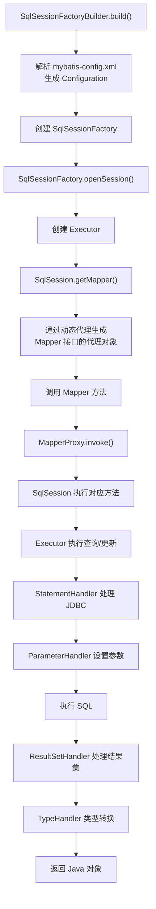

本章是一扇通往开源世界的大门，也是一扇通往 MyBatis 源码学习的大门。从 Git 入门到 GitHub 入门，读者可以学会使用最流行的分布式版本控制系统和源代码托管服务。通过一段代码了解 MyBatis 中的关键类，通过代码包讲解了解 MyBatis 每个包中所含的功能。最后通过 MyBatis 丰富的测试用例为读者提供更多学习内容。

## 11.1 Git 入门

Git 是目前最流行的**分布式版本控制系统**，由 Linus Torvalds 创建，用于管理 Linux 内核开发。学习 MyBatis 开源项目，首先需要掌握 Git 的基本使用。

### 11.1.1 初次运行配置

安装 Git 后，需要进行基本的用户信息配置：

```bash
# 配置用户名
git config --global user.name "Your Name"

# 配置邮箱
git config --global user.email "your.email@example.com"

# 查看所有配置
git config --list
```

- `--global` 表示全局配置，对当前用户的所有仓库生效
- 不加 `--global` 则仅对当前仓库生效
- 用户名和邮箱会记录在每次提交中，用于标识提交者

### 11.1.2 初始化和克隆仓库

两种获取 Git 仓库的方式：

**方式一：初始化本地仓库**

```bash
# 在当前目录初始化一个新的 Git 仓库
git init

# 在指定目录初始化
git init my-project
```

**方式二：克隆远程仓库**

```bash
# 通过 HTTPS 克隆
git clone https://github.com/mybatis/mybatis-3.git

# 通过 SSH 克隆
git clone git@github.com:mybatis/mybatis-3.git

# 克隆到指定目录
git clone https://github.com/mybatis/mybatis-3.git my-mybatis
```

### 11.1.3 本地操作

Git 文件的三种状态：**已修改（Modified）**、**已暂存（Staged）**、**已提交（Committed）**

```bash
# 查看文件状态
git status

# 将文件添加到暂存区
git add filename
git add .              # 添加所有修改

# 提交到本地仓库
git commit -m "提交说明"

# 查看提交历史
git log
git log --oneline      # 简洁模式

# 查看文件差异
git diff               # 工作区 vs 暂存区
git diff --cached      # 暂存区 vs 最近一次提交

# 撤销修改
git checkout -- filename   # 撤销工作区的修改
git reset HEAD filename    # 取消暂存
```

<aside>
💡

**Git 的三个工作区域**

- **工作目录（Working Directory）**：实际操作文件的地方
- **暂存区（Staging Area / Index）**：保存下次要提交的文件列表
- **Git 仓库（Repository）**：保存项目元数据和对象数据库
</aside>

### 11.1.4 远程操作

```bash
# 查看远程仓库
git remote -v

# 添加远程仓库
git remote add origin https://github.com/user/repo.git

# 从远程仓库拉取
git pull origin master

# 推送到远程仓库
git push origin master

# 获取远程仓库的更新（不自动合并）
git fetch origin
```

- `git pull` = `git fetch` + `git merge`，会自动合并
- `git fetch` 只下载远程更新，不会自动合并到当前分支

## 11.2 GitHub 入门

GitHub 是基于 Git 的**源代码托管服务**，也是全球最大的开源社区。MyBatis 的源码就托管在 GitHub 上。

### 11.2.1 创建并提交到仓库

1. 在 GitHub 上点击 **New repository** 创建新仓库
2. 填写仓库名称、描述，选择是否公开
3. 可选择初始化 README、`.gitignore` 和 License
4. 将本地项目推送到 GitHub：

```bash
# 关联远程仓库
git remote add origin https://github.com/username/repo.git

# 推送本地代码到远程
git push -u origin master
```

### 11.2.2 Fork 仓库并克隆到本地

参与开源项目的标准流程：

1. **Fork**：在目标项目页面点击 Fork 按钮，将项目复制到自己的账号下
2. **Clone**：将 Fork 后的项目克隆到本地

```bash
git clone https://github.com/your-username/mybatis-3.git
```

1. **添加上游仓库**：保持与原项目同步

```bash
git remote add upstream https://github.com/mybatis/mybatis-3.git
git fetch upstream
git merge upstream/master
```

1. **修改并提交**：在本地修改后推送到自己的 Fork 仓库
2. **Pull Request**：在 GitHub 上发起 PR，请求原项目合并你的修改

### 11.2.3 社交功能

GitHub 提供了丰富的社交功能，便于开发者之间的交流与协作：

- **Star**：收藏感兴趣的项目，相当于点赞
- **Watch**：关注项目动态，有更新时会收到通知
- **Fork**：复制项目到自己的账号下进行修改
- **Issues**：提交 Bug 报告、功能建议或进行讨论
- **Pull Request**：向原项目提交代码贡献
- **Follow**：关注其他开发者的动态

<aside>
📌

MyBatis 项目的 GitHub 地址为：[`https://github.com/mybatis/mybatis-3`](https://github.com/mybatis/mybatis-3)，可以通过 Star 和 Watch 来跟踪 MyBatis 的最新动态。

</aside>

## 11.3 MyBatis 源码讲解

本节通过一段简单的代码引出 MyBatis 中的关键类，并对源码包结构进行讲解。

### 核心执行流程

一段典型的 MyBatis 使用代码如下：

```java
// 1. 读取配置文件，创建 SqlSessionFactory
InputStream inputStream = Resources.getResourceAsStream("mybatis-config.xml");
SqlSessionFactory sqlSessionFactory =
    new SqlSessionFactoryBuilder().build(inputStream);

// 2. 通过 SqlSessionFactory 获取 SqlSession
SqlSession sqlSession = sqlSessionFactory.openSession();

try {
    // 3. 通过 SqlSession 获取 Mapper 接口的代理对象
    UserMapper userMapper = sqlSession.getMapper(UserMapper.class);

    // 4. 调用 Mapper 方法执行 SQL
    SysUser user = userMapper.selectById(1L);
} finally {
    // 5. 关闭 SqlSession
    sqlSession.close();
}
```

### 关键类说明

| **关键类** | **作用** |
| --- | --- |
| `SqlSessionFactoryBuilder` | 根据配置信息（XML 或 Java 代码）创建 `SqlSessionFactory`，创建完成后即可丢弃 |
| `SqlSessionFactory` | 创建 `SqlSession` 的工厂，应用运行期间应保持单例 |
| `SqlSession` | 与数据库交互的会话，包含所有执行 SQL 的方法，非线程安全，每次使用后应关闭 |
| `Configuration` | MyBatis 的全局配置类，保存所有配置信息（属性、设置、映射等），贯穿整个运行周期 |
| `MappedStatement` | 封装一个 SQL 映射（对应 XML 中的 `<select>`、`<insert>` 等节点或注解定义的 SQL） |
| `Executor` | SQL 执行器，负责查询缓存维护、SQL 执行和结果处理。三种类型：`SIMPLE`、`REUSE`、`BATCH` |
| `StatementHandler` | 封装 JDBC `Statement` 操作，负责设置参数、执行 SQL、处理结果集 |
| `ParameterHandler` | 负责将用户传入的参数转换为 JDBC `PreparedStatement` 所需的参数 |
| `ResultSetHandler` | 负责将 JDBC `ResultSet` 结果集转换为 Java 对象 |
| `TypeHandler` | 类型处理器，处理 Java 类型与 JDBC 类型之间的转换 |

### 源码包结构

MyBatis 源码按功能划分为多个包，主要结构如下：

| **包名** | **功能说明** |
| --- | --- |
| `org.apache.ibatis.session` | 核心会话包，包含 `SqlSession`、`SqlSessionFactory`、`Configuration` 等核心接口和类 |
| `org.apache.ibatis.executor` | 执行器包，包含 SQL 执行、结果处理、参数处理、语句处理等组件 |
| `org.apache.ibatis.mapping` | 映射包，包含 `MappedStatement`、`BoundSql`、`ResultMap` 等 SQL 映射相关类 |
| `org.apache.ibatis.builder` | 构建器包，解析 XML 配置文件和注解，构建 `Configuration` 对象 |
| `org.apache.ibatis.parsing` | 解析包，封装了 XPath 解析和通用 Token 解析功能 |
| `org.apache.ibatis.scripting` | 脚本包，处理动态 SQL 的解析和生成 |
| `org.apache.ibatis.reflection` | 反射包，封装反射操作，提供属性访问、对象创建等功能 |
| `org.apache.ibatis.type` | 类型处理包，包含所有内置的 `TypeHandler` 实现 |
| `org.apache.ibatis.cache` | 缓存包，提供一级缓存和二级缓存实现（装饰器模式） |
| `org.apache.ibatis.transaction` | 事务包，定义事务接口及 JDBC / Managed 两种事务实现 |
| `org.apache.ibatis.datasource` | 数据源包，提供内置数据源（UNPOOLED、POOLED、JNDI）的实现 |
| `org.apache.ibatis.plugin` | 插件包，提供拦截器机制（参考第 8 章） |
| `org.apache.ibatis.binding` | 绑定包，将 Mapper 接口与 XML 映射文件关联，生成 Mapper 接口的代理对象 |
| `org.apache.ibatis.annotations` | 注解包，包含 `@Select`、`@Insert`、`@Update`、`@Delete` 等所有注解定义 |
| [`org.apache.ibatis.io`](http://org.apache.ibatis.io) | 资源加载包，提供类路径和文件系统中加载资源的工具 |
| `org.apache.ibatis.logging` | 日志包，适配多种日志框架（SLF4J、Log4j、JDK Logging 等） |
| `org.apache.ibatis.exceptions` | 异常包，定义 MyBatis 的异常体系 |

### SQL 执行的完整流程



## 11.4 MyBatis 测试用例

MyBatis 源码中提供了大量的测试用例（位于 `src/test` 目录下），这些测试用例是学习 MyBatis 高级用法的宝贵资源。

### 测试用例的价值

- **学习示例**：每个功能模块都有对应的测试用例，覆盖了各种使用场景
- **验证理解**：通过运行测试用例，验证自己对 MyBatis 功能的理解
- **调试入口**：以测试用例为入口，设置断点逐步调试，深入理解 MyBatis 的执行流程

### 测试用例的组织结构

测试用例与源码包结构对应，主要包括：

| **测试包** | **测试内容** |
| --- | --- |
| `org.apache.ibatis.session` | `SqlSession` 的各种操作测试，如查询、插入、更新、删除 |
| `org.apache.ibatis.builder` | XML 配置解析、注解解析的测试 |
| `org.apache.ibatis.executor` | 不同类型 Executor 的执行测试 |
| `org.apache.ibatis.cache` | 一级缓存和二级缓存的测试 |
| `org.apache.ibatis.type` | 各种 TypeHandler 的类型转换测试 |
| `org.apache.ibatis.scripting` | 动态 SQL 解析和生成的测试 |
| `org.apache.ibatis.reflection` | 反射工具类的测试 |
| `org.apache.ibatis.plugin` | 插件拦截机制的测试 |

### 如何利用测试用例学习

1. **克隆 MyBatis 源码**

```bash
git clone https://github.com/mybatis/mybatis-3.git
cd mybatis-3
mvn clean install -DskipTests
```

1. **导入 IDE**：使用 IntelliJ IDEA 或 Eclipse 导入 Maven 项目
2. **运行测试**：找到感兴趣的测试类，直接运行或调试
3. **断点分析**：在关键类（如 `Executor`、`StatementHandler`）中设置断点，从测试用例入口跟踪完整的执行流程

<aside>
💡

**学习建议**：建议从 `org.apache.ibatis.session.SqlSessionTest` 入手，这个测试类覆盖了 MyBatis 最基本的 CRUD 操作，是理解 MyBatis 执行流程的最佳起点。

</aside>

## 11.5 本章小结

- 介绍了 **Git** 的基本配置、本地操作和远程操作，Git 是参与开源项目的必备工具
- 介绍了 **GitHub** 的使用方法，包括创建仓库、Fork 项目、发起 Pull Request 等开源协作流程
- 通过一段代码引出 MyBatis 的**关键类**（`SqlSessionFactory`、`SqlSession`、`Executor` 等），并详细讲解了源码的**包结构**，帮助读者建立对 MyBatis 源码的整体认识
- 介绍了 MyBatis 源码中丰富的**测试用例**，这些用例是学习 MyBatis 高级用法和深入理解源码的最佳资源