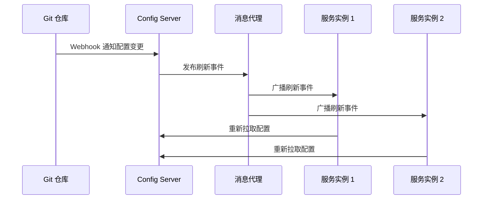

## 本章概要

- 共享配置的必要性
- 运行 Spring Cloud Config Server
- 创建 Config Server 客户端
- 提供特定应用和特定 profile 的属性
- 保护敏感配置信息
- 在运行时自动刷新配置属性

---

## 14.1 共享配置

在微服务架构中，多个服务可能共享相同的配置（如数据库连接、消息代理地址等）。如果每个服务都在自己的 `application.yml` 中维护这些配置，会导致：

- **配置分散**：同一属性在多个服务中重复定义，难以统一管理
- **变更困难**：修改某个共享属性时需要逐个更新每个服务，并重新部署
- **安全风险**：敏感信息（如密码）分散存储在各服务中，增加泄露风险

### 解决方案：集中式配置管理

**Spring Cloud Config Server** 提供了集中式的配置管理方案：

- 所有服务从一个**中心化的配置服务器**获取配置
- 配置存储在一个**后端仓库**中（如 Git、文件系统、Vault 等）
- 服务启动时从 Config Server 拉取配置，无需在本地保存

---

## 14.2 运行 Config Server

### 启用 Config Server

1. 添加依赖：

```xml
<dependency>
    <groupId>org.springframework.cloud</groupId>
    <artifactId>spring-cloud-config-server</artifactId>
</dependency>
```

1. 在引导类上添加 `@EnableConfigServer` 注解：

```java
@SpringBootApplication
@EnableConfigServer
public class ConfigServerApplication {
    public static void main(String[] args) {
        SpringApplication.run(ConfigServerApplication.class, args);
    }
}
```

### 配置 Git 后端仓库

Config Server 默认使用 **Git** 作为后端存储。在 `application.yml` 中配置：

```yaml
spring:
  cloud:
    config:
      server:
        git:
          uri: https://github.com/example/config-repo
          # 可选：指定搜索路径
          search-paths: config
          # 可选：指定默认分支
          default-label: main
```

- `uri`：Git 仓库地址，可以是远程仓库或本地路径（如 [`file:///path/to/repo`](file:///path/to/repo)）
- `search-paths`：在仓库中搜索配置文件的子目录
- `default-label`：默认使用的 Git 分支或标签

### Config Server 的端口设置

通常将 Config Server 运行在非默认端口上：

```yaml
server:
  port: 8888
```

### 使用文件系统后端

除了 Git，还可以使用本地文件系统作为后端（主要用于开发/测试）：

```yaml
spring:
  profiles:
    active: native
  cloud:
    config:
      server:
        native:
          search-locations: file:///path/to/config
```

---

## 14.3 消费共享配置

### 添加 Config Client 依赖

在需要从 Config Server 获取配置的微服务中添加依赖：

```xml
<dependency>
    <groupId>org.springframework.cloud</groupId>
    <artifactId>spring-cloud-starter-config</artifactId>
</dependency>
```

### 配置 Config Server 地址

在客户端的 `bootstrap.yml`（或 [`bootstrap.properties`](http://bootstrap.properties)）中指定 Config Server 的地址：

```yaml
spring:
  application:
    name: my-service
  cloud:
    config:
      uri: http://localhost:8888
```

> `bootstrap.yml` 会在 `application.yml` **之前**被加载，确保应用启动时就能从 Config Server 获取配置。
> 

### 工作流程

1. 客户端启动时读取 `bootstrap.yml` 中的 Config Server 地址和应用名称
2. 客户端向 Config Server 发送请求：`GET /{application}/{profile}`
3. Config Server 从 Git 仓库中查找匹配的配置文件并返回
4. 客户端将获取到的属性合并到本地的 Spring Environment 中

---

## 14.4 提供特定应用和 profile 的属性

Config Server 能够根据**应用名称**和**活动 profile** 提供不同的配置。

### 配置文件命名规则

在 Git 仓库中，配置文件按以下命名规则组织：

| **文件名** | **说明** |
| --- | --- |
| `application.yml` | 所有应用共享的通用配置 |
| `application-{profile}.yml` | 特定 profile 的共享配置（如 `application-production.yml`） |
| `{app-name}.yml` | 特定应用的配置（如 `my-service.yml`） |
| `{app-name}-{profile}.yml` | 特定应用在特定 profile 下的配置（如 `my-service-production.yml`） |

### 属性优先级（从低到高）

1. `application.yml` — 通用默认配置
2. `application-{profile}.yml` — 特定 profile 的共享配置
3. `{app-name}.yml` — 特定应用的配置
4. `{app-name}-{profile}.yml` — 特定应用 + 特定 profile 的配置

> 优先级高的属性会**覆盖**优先级低的同名属性。
> 

### REST API 端点

Config Server 暴露了 REST API 供客户端查询配置：

- `GET /{application}/{profile}` — 获取指定应用和 profile 的配置
- `GET /{application}/{profile}/{label}` — 指定 Git 分支或标签
- `GET /{application}-{profile}.yml` — 以 YAML 格式返回
- `GET /{application}-{profile}.properties` — 以 Properties 格式返回

---

## 14.5 保护敏感配置

配置中常包含数据库密码、API 密钥等敏感信息。直接以明文存储在 Git 仓库中并不安全。

### 方式一：在 Config Server 中加密属性

Config Server 支持对属性值进行**加密存储**，客户端获取时自动解密。

1. 设置加密密钥（对称加密）：

```yaml
encrypt:
  key: my-secret-key
```

1. 使用 Config Server 的加密端点加密属性值：

```bash
curl http://localhost:8888/encrypt -d 'my-password'
# 返回加密后的密文
```

1. 在配置文件中使用 `{cipher}` 前缀存储加密值：

```yaml
spring:
  datasource:
    password: '{cipher}AQA2d8f3...'
```

1. Config Server 在返回配置时会自动**解密**这些值

### 方式二：使用 HashiCorp Vault

对于更高安全要求，可以使用 **Vault** 作为 Config Server 的后端：

```yaml
spring:
  cloud:
    config:
      server:
        vault:
          host: localhost
          port: 8200
          scheme: https
```

- Vault 专门用于管理敏感数据（密码、令牌、证书等）
- 支持细粒度的访问控制和审计日志
- Config Server 可以同时使用 Git 和 Vault（**组合后端**），普通属性存 Git，敏感属性存 Vault

---

## 14.6 运行时刷新配置属性

默认情况下，客户端只在**启动时**从 Config Server 获取配置。如果配置变更，需要重启服务才能生效。Spring Cloud 提供了多种方式在运行时刷新配置。

### 方式一：手动刷新

1. 添加 Actuator 依赖：

```xml
<dependency>
    <groupId>org.springframework.boot</groupId>
    <artifactId>spring-boot-starter-actuator</artifactId>
</dependency>
```

1. 在需要动态刷新的 Bean 上添加 `@RefreshScope` 注解：

```java
@RefreshScope
@Component
@ConfigurationProperties(prefix = "my.config")
public class MyConfig {
    private String greeting;
    // getter / setter
}
```

1. 向客户端发送 POST 请求触发刷新：

```bash
curl -X POST http://localhost:8080/actuator/refresh
```

> 缺点：需要对每个服务实例逐一发送刷新请求，在大规模微服务环境中不够实用。
> 

### 方式二：自动刷新（Spring Cloud Bus）

**Spring Cloud Bus** 可以将刷新事件广播给所有服务实例：

1. 添加依赖（以 RabbitMQ 为例）：

```xml
<dependency>
    <groupId>org.springframework.cloud</groupId>
    <artifactId>spring-cloud-starter-bus-amqp</artifactId>
</dependency>
```

1. 向任意一个服务实例发送刷新请求：

```bash
curl -X POST http://localhost:8080/actuator/bus-refresh
```

1. 该实例通过消息代理（RabbitMQ / Kafka）将刷新事件广播给所有连接的服务实例

### 自动刷新流程



### 配合 Git Webhook

可以在 Git 仓库中配置 **Webhook**，当配置文件被推送更新时，自动通知 Config Server，由 Config Server 通过 Spring Cloud Bus 广播刷新事件，实现**全自动的配置热更新**。

---

## 本章小结

<aside>
💡

**小结**：在微服务架构中，集中式配置管理至关重要。**Spring Cloud Config Server** 提供了从 Git 等后端仓库集中管理和分发配置的能力。客户端可以通过 Config Client 自动获取配置，并通过 `{cipher}` 加密或 Vault 保护敏感信息。配合 `@RefreshScope` 和 **Spring Cloud Bus**，还可以实现配置的运行时自动刷新，无需重启服务。

</aside>