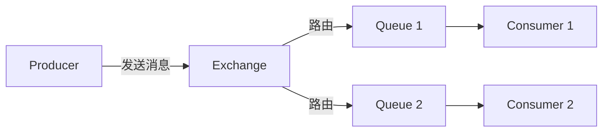

本章涵盖：

- 异步消息传递
- 使用 JMS、RabbitMQ 和 Kafka 发送消息
- 从代理（broker）拉取消息
- 监听消息

---

## 8.1 使用 JMS 发送消息

JMS（Java Message Service）是一个 Java 标准，定义了使用消息代理（message broker）的通用 API。Spring 通过 `JmsTemplate` 简化了 JMS 的使用。

### 8.1.1 搭建 JMS 环境

Spring Boot 支持两种 JMS broker：

- **ActiveMQ**
- **ActiveMQ Artemis**（推荐）
- Artemis 依赖配置
    
    ```xml
    <dependency>
      <groupId>org.springframework.boot</groupId>
      <artifactId>spring-boot-starter-artemis</artifactId>
    </dependency>
    ```
    
- 常用配置属性
    
    
    | 属性 | 说明 |
    | --- | --- |
    | [`spring.artemis.host`](http://spring.artemis.host) | broker 的主机 |
    | `spring.artemis.port` | broker 的端口 |
    | `spring.artemis.user` | 用于访问 broker 的用户名 |
    | `spring.artemis.password` | 用于访问 broker 的密码 |

### 8.1.2 使用 JmsTemplate 发送消息

`JmsTemplate` 是 Spring 对 JMS 的核心抽象，消除了大量样板代码。

- 主要发送方法
    - `send(MessageCreator)` — 发送到默认目的地
    - `send(Destination, MessageCreator)` — 发送到指定 Destination 对象
    - `send(String destinationName, MessageCreator)` — 发送到指定名称的目的地
    - `convertAndSend(Object)` — 自动将对象转换为消息后发送
    - `convertAndSend(Object, MessagePostProcessor)` — 转换并通过后处理器自定义消息
- 示例：使用 send()
    
    ```java
    @Service
    public class JmsOrderMessagingService implements OrderMessagingService {
    
        private JmsTemplate jms;
    
        @Autowired
        public JmsOrderMessagingService(JmsTemplate jms) {
            this.jms = jms;
        }
    
        @Override
        public void sendOrder(TacoOrder order) {
            jms.send("tacocloud.order.queue", session -> {
                return session.createObjectMessage(order);
            });
        }
    }
    ```
    
- 示例：使用 convertAndSend()
    
    ```java
    @Override
    public void sendOrder(TacoOrder order) {
        jms.convertAndSend("tacocloud.order.queue", order);
    }
    ```
    

> `convertAndSend()` 会自动使用消息转换器（MessageConverter）将对象序列化为消息，大幅简化代码。
> 

### 8.1.3 配置消息转换器

Spring 提供多种 `MessageConverter` 实现：

| 转换器 | 说明 |
| --- | --- |
| `SimpleMessageConverter` | 默认，简单类型与 TextMessage/BytesMessage 的转换 |
| `MappingJackson2MessageConverter` | 使用 Jackson 2 将对象转换为 JSON（**推荐**） |
| `MarshallingMessageConverter` | 使用 JAXB 将对象转换为 XML |
| `MessagingMessageConverter` | 基于底层 MessageConverter 和 JmsHeaderMapper 的转换 |
- 配置 Jackson 消息转换器
    
    ```java
    @Bean
    public MappingJackson2MessageConverter messageConverter() {
        MappingJackson2MessageConverter converter =
            new MappingJackson2MessageConverter();
        converter.setTypeIdPropertyName("_typeId");
        return converter;
    }
    ```
    

### 8.1.4 后处理消息（MessagePostProcessor）

在消息发送前添加自定义消息头：

```java
jms.convertAndSend("tacocloud.order.queue", order, message -> {
    message.setStringProperty("X_ORDER_SOURCE", "WEB");
    return message;
});
```

### 8.1.5 接收 JMS 消息

两种模式：

- **拉模式（Pull）** — 使用 `JmsTemplate.receive()` 或 `receiveAndConvert()` 主动获取
- **推模式（Push）** — 使用 `@JmsListener` 注解声明监听器
- 拉模式示例
    
    ```java
    @Component
    public class JmsOrderReceiver implements OrderReceiver {
        private JmsTemplate jms;
        private MessageConverter converter;
    
        public TacoOrder receiveOrder() {
            return (TacoOrder) jms.receiveAndConvert("tacocloud.order.queue");
        }
    }
    ```
    
- 推模式示例（推荐）
    
    ```java
    @Component
    public class OrderListener {
    
        @JmsListener(destination = "tacocloud.order.queue")
        public void receiveOrder(TacoOrder order) {
            // 处理订单...
        }
    }
    ```
    

<aside>
💡

`@JmsListener` 是被动监听方式，消息到达后自动触发方法调用，比拉模式更高效、更常用。

</aside>

---

## 8.2 使用 RabbitMQ 和 AMQP

RabbitMQ 是最流行的 AMQP（Advanced Message Queuing Protocol）实现之一。与 JMS 的区别在于，RabbitMQ 引入了 **Exchange（交换器）** 的概念。

### 8.2.1 核心概念



消息不直接发送到队列，而是发送到 Exchange，由 Exchange 根据 **routing key** 和 **binding** 规则路由到一个或多个队列。

- Exchange 类型
    
    
    | 类型 | 说明 |
    | --- | --- |
    | **Default** | 自动绑定到与 routing key 同名的队列 |
    | **Direct** | routing key 精确匹配 binding key |
    | **Topic** | routing key 通配符匹配（`*` 匹配一个词，`#` 匹配零个或多个词） |
    | **Fanout** | 广播到所有绑定的队列，忽略 routing key |
    | **Headers** | 基于消息头匹配，不使用 routing key |

### 8.2.2 添加 RabbitMQ 依赖

```xml
<dependency>
  <groupId>org.springframework.boot</groupId>
  <artifactId>spring-boot-starter-amqp</artifactId>
</dependency>
```

- 常用配置属性
    
    
    | 属性 | 说明 | 默认值 |
    | --- | --- | --- |
    | [`spring.rabbitmq.host`](http://spring.rabbitmq.host) | RabbitMQ 主机 | [localhost](http://localhost) |
    | `spring.rabbitmq.port` | 端口 | 5672 |
    | `spring.rabbitmq.username` | 用户名 | guest |
    | `spring.rabbitmq.password` | 密码 | guest |

### 8.2.3 使用 RabbitTemplate 发送消息

`RabbitTemplate` 与 `JmsTemplate` 类似，方法签名中多了 exchange 和 routing key 参数。

```java
@Service
public class RabbitOrderMessagingService implements OrderMessagingService {

    private RabbitTemplate rabbit;

    public RabbitOrderMessagingService(RabbitTemplate rabbit) {
        this.rabbit = rabbit;
    }

    public void sendOrder(TacoOrder order) {
        rabbit.convertAndSend("tacocloud.order.queue", order);
    }
}
```

### 8.2.4 接收 RabbitMQ 消息

同样支持拉模式和推模式：

- 拉模式
    
    ```java
    public TacoOrder receiveOrder() {
        return (TacoOrder) rabbit.receiveAndConvert("tacocloud.order.queue");
    }
    ```
    
- 推模式（推荐）
    
    ```java
    @Component
    public class OrderListener {
    
        @RabbitListener(queues = "tacocloud.order.queue")
        public void receiveOrder(TacoOrder order) {
            // 处理订单...
        }
    }
    ```
    

---

## 8.3 使用 Kafka 发送消息

Kafka 是一个高吞吐量的分布式流处理平台，与 JMS 和 RabbitMQ 有本质区别：

- Kafka 以 **集群** 形式运行，具有极高的可扩展性
- 消息以 **Topic** 组织，Topic 可分为多个 **Partition**，分布在集群的多个节点上
- 消息被**持久化**并可重复消费

### 8.3.1 搭建 Kafka 环境

```xml
<dependency>
  <groupId>org.springframework.kafka</groupId>
  <artifactId>spring-kafka</artifactId>
</dependency>
```

- 常用配置属性
    
    
    | 属性 | 说明 | 默认值 |
    | --- | --- | --- |
    | `spring.kafka.bootstrap-servers` | Kafka 服务器地址 | [localhost:9092](http://localhost:9092) |
    | `spring.kafka.template.default-topic` | 默认 Topic | — |

### 8.3.2 使用 KafkaTemplate 发送消息

`KafkaTemplate` 与前两者不同，它只有 `send()` 方法，没有 `convertAndSend()`，因为 Kafka 的序列化由 Serializer 配置完成。

```java
@Service
public class KafkaOrderMessagingService implements OrderMessagingService {

    private KafkaTemplate<String, TacoOrder> kafkaTemplate;

    public KafkaOrderMessagingService(
            KafkaTemplate<String, TacoOrder> kafkaTemplate) {
        this.kafkaTemplate = kafkaTemplate;
    }

    @Override
    public void sendOrder(TacoOrder order) {
        kafkaTemplate.send("tacocloud.orders.topic", order);
    }
}
```

`send()` 的参数可包含：topic、partition、key、data 和 timestamp。

### 8.3.3 编写 Kafka 监听器

使用 `@KafkaListener` 注解接收消息：

```java
@Component
public class OrderListener {

    @KafkaListener(topics = "tacocloud.orders.topic")
    public void handle(TacoOrder order) {
        // 处理订单...
    }
}
```

还可以接收更多元数据：

```java
@KafkaListener(topics = "tacocloud.orders.topic")
public void handle(TacoOrder order, ConsumerRecord<String, TacoOrder> record) {
    log.info("Received from partition {} with timestamp {}",
        record.partition(), record.timestamp());
}
```

<aside>
⚠️

Kafka 没有拉模式（`receive()`），只能使用 `@KafkaListener` 推模式来接收消息。

</aside>

---

## 8.4 三种消息方案对比

| **特性** | **JMS（ActiveMQ/Artemis）** | **RabbitMQ（AMQP）** | **Kafka** |
| --- | --- | --- | --- |
| 核心模板 | `JmsTemplate` | `RabbitTemplate` | `KafkaTemplate` |
| 监听注解 | `@JmsListener` | `@RabbitListener` | `@KafkaListener` |
| 消息路由 | 目的地（Queue/Topic） | Exchange + Routing Key + Binding | Topic + Partition |
| 拉模式 | ✅ `receive()` | ✅ `receive()` | ❌ 不支持 |
| 消息持久化 | 可配置 | 可配置 | 默认持久化 |
| 适用场景 | 传统企业消息 | 灵活路由需求 | 高吞吐量/流处理 |

---

## 本章小结

- **异步消息传递**可以实现应用间的间接通信，降低耦合、提高可扩展性
- Spring 通过 `JmsTemplate`、`RabbitTemplate`、`KafkaTemplate` 三套模板统一了消息发送的编程模型
- **消息接收**有两种方式：拉模式（主动调用 `receive()`）和推模式（使用 `@XxxListener` 注解），推模式更常用
- **JMS** 适合传统 Java 企业应用；**RabbitMQ** 的 Exchange 机制提供了更灵活的路由；**Kafka** 则以高吞吐量和消息持久化见长，适合大数据和流处理场景